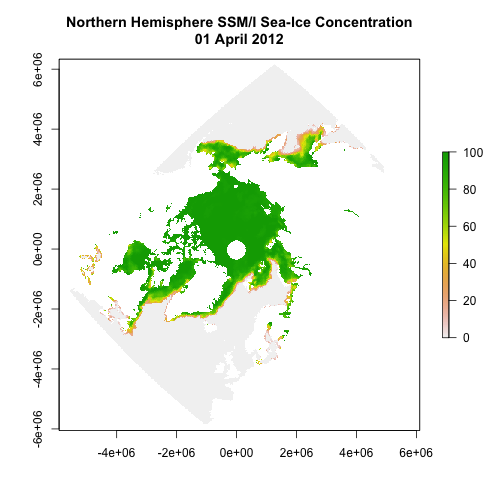
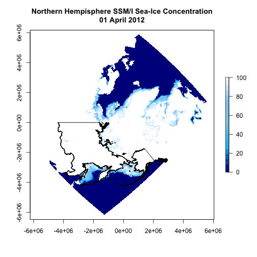
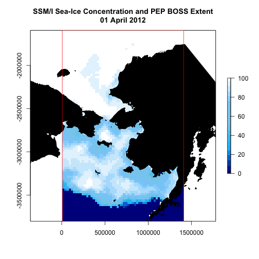

Creating Geo-Spatial Analysis Grid for PEP and BOSS Surveys
===========================================================

### 12 June 2012

### EASE-Grid v2.0

EASE-grid is an abbrevation for *Equal-Area Scalable Earth Grid*. It is intended to be a versatile format for global-scale gridded data, specifically remotely sensed data, although it has gained popularity as a common gridding scheme for other data as well. Data from various sources can be expressed as digital arrays of varying grid resolutions, which are defined in relation to one of three possible projections: Northern and Southern Hemisphere (Lambert's equal-area, azimuthal) and full global (cylindrical, equal-area). There are two versions of EASE-Grid; the first was defined in 1992 and has been used for many data sets, while EASE-Grid 2.0 was defined in 2011 and is recommended for new data sets.

Original EASE-Grid Format Description
[http://nsidc.org/data/ease/ease_grid.html](http://nsidc.org/data/ease/ease_grid.html)

EASE-Grid 2.0 Format Description
[http://nsidc.org/data/ease/ease_grid2.html](http://nsidc.org/data/ease/ease_grid2.html)

### PEP Spatial Analysis Grid

To facilitate geo-spatial analysis of data from the 2012+ BOSS effort a subset of the EASE-Grid v2.0 will be used. For this purpose, we will maintain the grid structure used for distribution of SSM/I sea-ice concentration, but specify only a subset of cells that are relevant to our study area.

### Getting Started in R

To get started in R, we'll load in our essential spatial packages


```r
library(rgdal)
```


```
## Loading required package: sp
```


```
## Geospatial Data Abstraction Library extensions to R successfully loaded
## Loaded GDAL runtime: GDAL 1.9.1, released 2012/05/15
## Path to GDAL shared files: /Library/Frameworks/GDAL.framework/Versions/1.9/Resources/gdal
## Loaded PROJ.4 runtime: Rel. 4.8.0, 6 March 2012, [PJ_VERSION: 480]
## Path to PROJ.4 shared files: (autodetected)
```


```r
library(sp)
library(rgeos)
```


```
## Loading required package: stringr
```


```
## rgeos: (SVN revision 330)
##  GEOS runtime version: 3.3.5-CAPI-1.7.5 
##  Polygon checking: TRUE 
##  WARNING! if you turn polygon checking off, and polygons are
##  not valid in GEOS, you risk losing data as your R session may crash! 
## 
```


```r
library(raster)
```


```
## raster 1.9-92 (1-May-2012)
```


We will also load up a personal package `nPacMaps` which provides US, Russia and Canada as *SpatialPolygons*. The package is available upon request from JML.


```r
library(nPacMaps)
```


To determine the boundaries of our study area, we need to examine the SSM/I EASE-Grid cells along with Russia and US land polygons. We'll use one of the daily SSM/I EASE-Grid GeoTIFF files as a basis for creating the grid. So, let's download the GeoTIFF from the new akc-nmml/polar/data directory on the AFSC network and read it into R as a *RasterLayer* object using the `raster` package.


```r
tmp <- tempfile(fileext = ".tif")
download.file(paste("file:///Volumes/Polar/Data/Environ/SeaIce/SSMI_SIC/2012/", 
    "nt_20120401_f17_nrt_n.bin.reproj.tif", sep = ""), tmp)
# non-mac users will likely need to replace /Volumes/ with
# //afsc/akc-nmml/
r <- raster(tmp)
r
```


```
## class       : RasterLayer 
## dimensions  : 480, 480, 230400  (nrow, ncol, ncell)
## resolution  : 25068, 25068  (x, y)
## extent      : -5922823, 6109589, -5874646, 6157766  (xmin, xmax, ymin, ymax)
## coord. ref. : +proj=laea +lat_0=90 +lon_0=0 +x_0=0 +y_0=0 +datum=WGS84 +units=m +no_defs +ellps=WGS84 +towgs84=0,0,0 
## values      : /private/var/folders/42/x3dcnwt91pgdvgdmn_l3gtkh0004p2/T/RtmptNwY0y/file41ee65fdf06d.tif 
## min value   : 0 
## max value   : 255 
## layer name  : file41ee65fdf06d 
## 
```


The PROJ4 string for this file should read:

`+proj=laea +lat_0=90 +lon_0=0 +x_0=0 +y_0=0 +datum=WGS84 +units=m +no_defs`

If this projection is not recognized (as appears to be the case for Windows installations), another command will need to be run to set the projection data.


```r
projection(r) <- "+proj=laea +lat_0=90 +lon_0=0 +x_0=0 +y_0=0 +datum=WGS84 +units=m +no_defs"
```


### NSIDC SSM/I GeoTiff Sea-ice Concentration Files

The coordinate reference system describes the EASE Grid v2.0 projection. This is an equal area projection based on the Lambert Azimuthal Equal Area projection and is centered with a latitude of origin at the north pole and a longitude of origin set to 0 degrees. The nominal cell dimension is 25km x 25km, however, as is shown above, the actual dimension is 25.06753km x 25.06753km.

The data within the raster are stored as one-byte values that need to be decoded. The following text from the [NSIDC website](http://nsidc.org/data/docs/daac/nsidc0051_gsfc_seaice.gd.html#paramrange) desribes the coding.

> Data are stored as one-byte integers representing sea ice concentration values. 
> The sea ice concentration data are packed into byte format by multiplying the 
> derived fractional sea ice concentration floating-point values (ranging from 
> 0.0 to 1.0) by a scaling factor of 250. For example, a sea ice concentration 
> value of 0.0 (0%) maps to a stored one-byte integer value of 0, and a sea ice 
> concentration value of 1.0 (100%) maps to a stored one-byte integer value of 
> 250. To convert to the fractional parameter range of 0.0 to 1.0, divide the 
> scaled data in the file by 250. To convert to percentage values (0% to 100%), 
> divide the scaled data in the file by 2.5.

> Data files may contain integers from 0 to 255, as described 
> 
> **0 - 250** .... Sea ice concentration (fractional coverage scaled by 250)
> **251** ........ Circular mask used in the Arctic to cover the irregularly-shaped
> data gap around the pole (caused by the orbit inclination and 
> instrument swath)
> **252** ........ Unused
> **253** ........ Coastlines
> **254** ........ Superimposed land mask
> **255** ........ Missing data

So, we need to divide the values 0-250 by 2.5 to represent sea-ice concentration and either leave the 251-255 values as is or set them to NA. In this case, we'll set all values above 250 to NA. We can do this using the `calc` function within the `raster` package.


```r
fun <- function(x) {
    ifelse(x < 251, x/2.5, NA)
}
sic_raster <- calc(r, fun)
```


```r
plot(sic_raster, main = "Northern Hemisphere SSM/I Sea-Ice Concentration\n01 April 2012")
```

 


Since the longitude of origin for this projection is 0 degrees, the map is oriented with our region of interest (Bering Sea) upside down. To resolve this, we'll use the `projectRaster` function to set the latitude of origin to 180. We'll specify the same grid resolution (25067.53 x 25067.53) and this should keep the raster aligned to the original grid.

First, we will need to edit the PROJ.4 string to reflect this new orientation


```r
laea_180_proj <- paste("+proj=laea +lat_0=90 +lon_0=180 +x_0=0 +y_0=0", 
    "+datum=WGS84 +units=m +no_defs +ellps=WGS84 +towgs84=0,0,0")
```


And, now, we'll re-project the raster and also re-project the *alaska_dcw* and *russia_dcw* from the `nPacMaps` package to this new projection


```r
sic_raster <- projectRaster(sic_raster, res = c(25067.53, 25067.53), 
    crs = laea_180_proj)
data(alaska_dcw)
data(russia_dcw)

alaska_dcw <- spTransform(alaska_dcw, CRS(laea_180_proj))
russia_dcw <- spTransform(russia_dcw, CRS(laea_180_proj))
```


```r
plot(sic_raster, col = colorRampPalette(c("dark blue", "deepskyblue", 
    "skyblue", "lightskyblue", "white"))(20), main = "Northern Hempisphere SSM/I Sea-Ice Concentration\n01 April 2012")
plot(alaska_dcw, add = TRUE)
plot(russia_dcw, add = TRUE)
```

 


For our purposes, we are only intersted in a sub-section of this grid. The first thing needed is to establish an extent that defines the area of interest. For this, we've settled on the following values:


```r
x_min <- 0
x_max <- 1400000
y_min <- -3800000
y_max <- -1600000
```


And, then create an *extent* object, we'll call `pep_ext`


```r
pep_ext <- extent(x_min, x_max, y_min, y_max)
```


We can use the `crop` function within the `raster` package to crop our `sic_raster` to this extent. By specifying "snap='near'", the function will snap the extent to the same grid as `sic_raster` prior to cropping. 


```r
sic_raster <- crop(sic_raster, pep_ext, snap = "near")
pep_ext <- extent(sic_raster)
```


```r
plot(sic_raster, col = colorRampPalette(c("dark blue", "deepskyblue", 
    "skyblue", "lightskyblue", "white"))(20), main = "SSM/I Sea-Ice Concentration and PEP BOSS Extent\n01 April 2012")
plot(alaska_dcw, col = "black", add = TRUE)
plot(russia_dcw, col = "black", add = TRUE)
plot(pep_ext, col = "red", add = TRUE)
```

 


